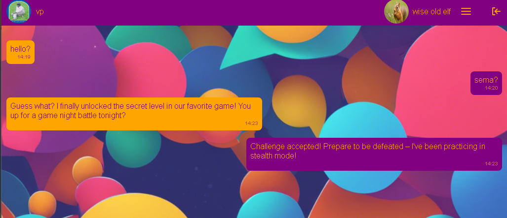
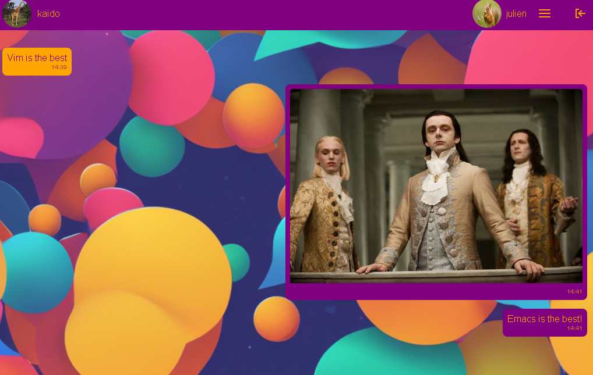

# Table of Contents

1.  [Introduction](#org50fbf1d)
2.  [Getting Started](#org6b717f6)
3.  [Screenshots](#org396b13a)
    1.  [conversation with text](#org32f51f3)
    2.  [conversation with images](#orge7f9dff)
4.  [Technologies](#org9729beb)
5.  [API](#org1d4b586)
    1.  [messages](#org0bb5db3)
    2.  [conversations](#org8529559)
    3.  [users](#orgc043000)
6.  [Related Projects](#org38d568e)
7.  [Future](#org1384172)
8.  [Authors](#org500fa3d)
9.  [Acknowledgements](#org809ccd1)
10. [License](#orge4034d3)

# Introduction

Experience the full spectrum of connection: Chatsphere - Where every exchange is a visual symphony.
Experience seamless connections with the most secure and reliable messaging platform.Use ChatSphere to start and join conversations.

This is my personal messaging project that allows people to communicate with each other with ease. They can share simple messages and even images during a conversation. It is a simple but complex project that propelled me to learn about Software Engineering.

# Getting Started

1.  Visit the ChatSphere page
2.  Create account or login using Oauth or with your custom credentials

# Screenshots

## conversation with text

## conversation with images

# Technologies

-   Frontend: HTML, CSS, JQuery, JavaScript
-   Backend: Flask - (create dynamic web pages by serving HTML templates using Jinja2, Handle Restful API requests, connect to DB, perform CRUD operations, and implement authentication and authorization)
-   Storage: MySQL (version 5.7\*) and Redis; the latter for caching. SQLAlchemy as the ORM of choice.
-   Authentication and authorization: Oauth2(googleauthoauthlib, google.oauth2 libraries, etc.) and Flask sessions among others.

# API

The frontend communicates with the backend storage via a Flask API. Various endpoints have been configured to suite the needs of the project. 

## messages

A conversation can only be between two or more participants. As such, it would be best to group messages by a conversation such that two participants interact with each other through a Conversation object containing such participants and their messages.

<table border="2" cellspacing="0" cellpadding="6" rules="groups" frame="hsides">

<colgroup>
<col  class="org-left" />

<col  class="org-left" />

<col  class="org-left" />
</colgroup>
<tbody>
<tr>
<td class="org-left">HTTP Method</td>
<td class="org-left">Endpoint</td>
<td class="org-left">Purpose</td>
</tr>

<tr>
<td class="org-left">-----------</td>
<td class="org-left">-------------------------------------------------------------</td>
<td class="org-left">-----------------------------------</td>
</tr>

<tr>
<td class="org-left">GET</td>
<td class="org-left">api/v1/conversations/<conversationid>/messages</td>
<td class="org-left">Retrieve list of all Message objects</td>
</tr>

<tr>
<td class="org-left">POST</td>
<td class="org-left">api/v1/conversations/<conversationid>/messages</td>
<td class="org-left">Post a Message object</td>
</tr>

<tr>
<td class="org-left">DELETE</td>
<td class="org-left">api/v1/conversations/<conversationid>/messages/<messageid></td>
<td class="org-left">Delete a Message object</td>
</tr>

<tr>
<td class="org-left">POST</td>
<td class="org-left">api/v1/conversations/<conversationid>/<senderid>/messages/file</td>
<td class="org-left">Post a Message object with file</td>
</tr>
</tbody>
</table>

## conversations

<table border="2" cellspacing="0" cellpadding="6" rules="groups" frame="hsides">

<colgroup>
<col  class="org-left" />

<col  class="org-left" />

<col  class="org-left" />
</colgroup>
<tbody>
<tr>
<td class="org-left">HTTP Method</td>
<td class="org-left">Endpoint</td>
<td class="org-left">Purpose</td>
</tr>

<tr>
<td class="org-left">-----------</td>
<td class="org-left">------------------------------------------</td>
<td class="org-left">----------------------------------------------</td>
</tr>

<tr>
<td class="org-left">GET</td>
<td class="org-left">api/v1/users/conversations/<uderid></td>
<td class="org-left">Retrieve list of all Conversation objects</td>
</tr>

<tr>
<td class="org-left">GET</td>
<td class="org-left">api/v1/conversations/<user1id>/<user2id></td>
<td class="org-left">Retrieve a Conversation object by participants</td>
</tr>

<tr>
<td class="org-left">GET</td>
<td class="org-left">api/v1/conversations/<conversationid></td>
<td class="org-left">Retrieve a Conversation object by id</td>
</tr>

<tr>
<td class="org-left">POST</td>
<td class="org-left">api/v1/conversations/</td>
<td class="org-left">Post a Conversation object</td>
</tr>

<tr>
<td class="org-left">DELETE</td>
<td class="org-left">api/v1/conversations/<conversationid></td>
<td class="org-left">Delete a Conversation object</td>
</tr>
</tbody>
</table>

## users

<table border="2" cellspacing="0" cellpadding="6" rules="groups" frame="hsides">

<colgroup>
<col  class="org-left" />

<col  class="org-left" />

<col  class="org-left" />
</colgroup>
<tbody>
<tr>
<td class="org-left">HTTP Method</td>
<td class="org-left">Endpoint</td>
<td class="org-left">Purpose</td>
</tr>

<tr>
<td class="org-left">-----------</td>
<td class="org-left">-------------------------------</td>
<td class="org-left">--------------------------------------</td>
</tr>

<tr>
<td class="org-left">GET</td>
<td class="org-left">api/v1/users</td>
<td class="org-left">Retrieve list of all User objects</td>
</tr>

<tr>
<td class="org-left">GET</td>
<td class="org-left">api/v1/users/<userid></td>
<td class="org-left">Retrieve a User object by user id</td>
</tr>

<tr>
<td class="org-left">GET</td>
<td class="org-left">api/v1/users/<userid>/image</td>
<td class="org-left">Retrieve a User object's profile image</td>
</tr>

<tr>
<td class="org-left">POST</td>
<td class="org-left">api/v1/users</td>
<td class="org-left">Post a User object</td>
</tr>

<tr>
<td class="org-left">PUT</td>
<td class="org-left">api/v1/users/<userid></td>
<td class="org-left">Update a User object</td>
</tr>

<tr>
<td class="org-left">PUT</td>
<td class="org-left">api/v1/users/<userid>/upload</td>
<td class="org-left">Update a User object's image</td>
</tr>

<tr>
<td class="org-left">DELETE</td>
<td class="org-left">api/v1/users/<userid></td>
<td class="org-left">Delete a User object</td>
</tr>
</tbody>
</table>

# Related Projects

# Future

# Authors

Francis Kamau is a skilled Software Engineer trained by ALX.
Feel free to reach out to Francis for any opportunities or collaborations.

# Acknowledgements

-   ALX: Thanks Julien and ALX mentors for the opportunity to learn, upskill and do hard things at ALX. Much thanks to all peers for the support.
-   \#TeamEmacs: Who needs the hell of exiting Vim?

# License

