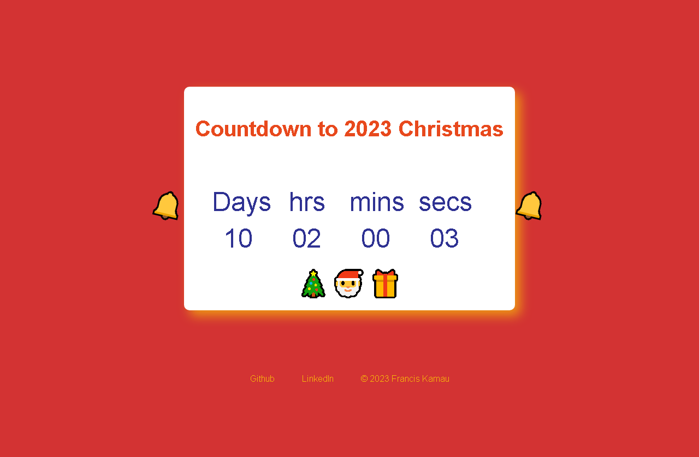

# Table of Contents

1.  [2023 Christmas countdown](#org96dc95c)
2.  [Introduction](#orgf7f1447)
3.  [Getting Started](#org4c063b0)
    1.  [Project files](#org36db2ac)
4.  [Screenshots](#org488cb88)
5.  [Technologies](#org6a08bde)
6.  [Related Projects](#org4988e2d)
7.  [Future](#orgd4d59a3)
8.  [NB](#orgb9e5d75)
9.  [Authors](#orga714281)
10. [Acknowledgements](#org7d29af4)

# Christmas Countdown Timer

Anticipate the joy of christmas with an awesome countdown

# Introduction

Experience the magic of the season on our Christmas Countdown site,
featuring a mesmerizing animated timer, a jingling Christmas bell,
and a heartwarming 'Merry Christmas' message, promising a joyous
surprise when the festivities arrive.

I built the app inside my final [ALX](https://www.alxafrica.com/) project directory to take advantage
of existing technologies especially access via HTTPS.
It is part of the ALX Holiday Challenge with an aim of having "fun,
learn, and celebrate the holiday season through creativs codng" - ALX.

# Getting Started

-   Just visit <https://techinspire.tech/xmas_countdown> and enjoy the countdown.
-   No signup required.

## Project files

-   [main route](https://github.com/fk2019/ChatSphere/blob/master/web_dynamic/views/main.py)
-   [html](https://github.com/fk2019/ChatSphere/blob/master/web_dynamic/templates/xmas.html)
-   [html](https://github.com/fk2019/ChatSphere/blob/master/web_dynamic/static/css/xmas.css)
-   [js](https://github.com/fk2019/ChatSphere/blob/master/web_dynamic/static/js/xmas.js)

# Screenshots

# Technologies

-   The frontend is built with HTML, css, and Javascript.
-   Backend contains a flask route that is also mirrored in a Nginx server that points to this route.
-   Site is served from an AWS EC2 instance through Haproxy on another instance. (Loved how ALX would allow us to spin up new servers from AWS and even destroy them during our foundations phase. So I decided to learn AWS cloud to host my projects.

# Related Projects

-   [ChatSphere](https://github.com/fk2019/ChatSphere/tree/master?tab=readme-ov-file#chatsphere)

(in progress)

# Future

-   Add additional animations and glow
-   More joy and functionality

# NB

-   Build it in about 4hrs because of time constraints on my part

# Authors

[Francis Kamau](https://github.com/fk2019)

Francis is a Software Engineer trained by [ALX](https://www.alxafrica.com/) and equipped with key skills
required in a variety of cyber industries.

Please feel free to reach out to [Francis](https://github.com/fk2019) for any collaboration
opportunities or inquiries.

# Acknowledgements

-   ALX: The opportunity to learn, collaborate, and enjoy Software Engineering at the most transformative institution is amazing. Thanks.
-   Cohort 11 and all peers: Thanks so much for your motivation and support.
-   \#TeamEmacs: For saving from the hell of exiting vim :)

